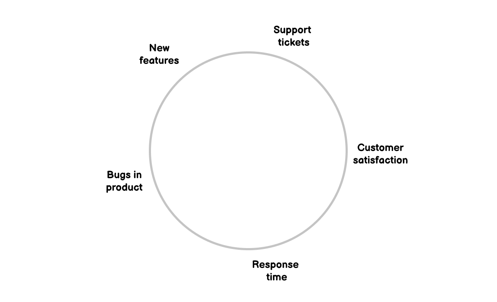
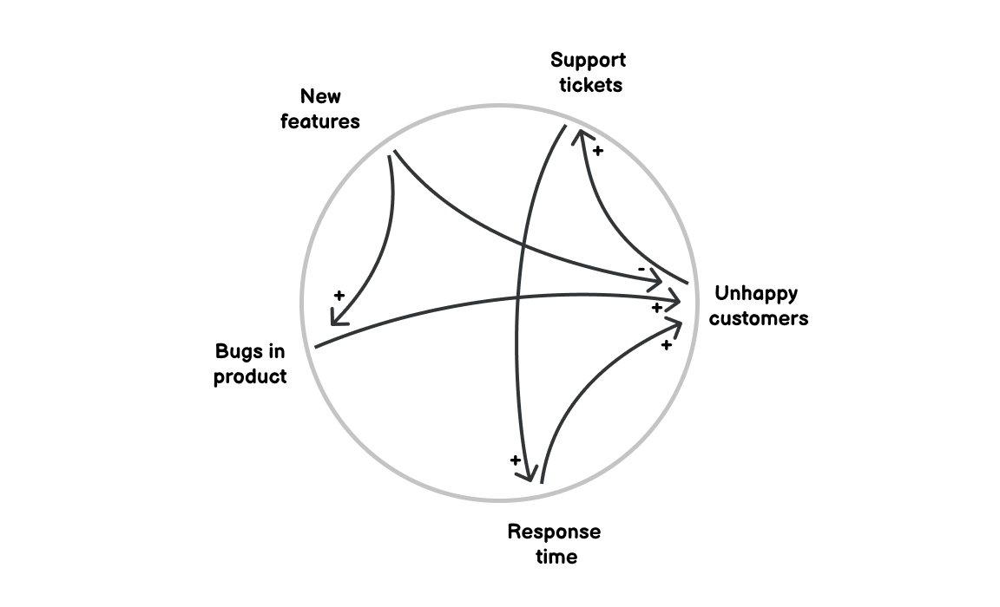

## Connection circles

**Understand relationships and identify feedback loops within systems.**

Connection circles are a tool for visualising relationships in a story or a system. They help you understand complexity by seeing causes and effects in the system.

Connection circles can also help you identify feedback loops – whether [reinforcing](/reinforcing-feedback-loop) or [balancing](/balancing-feedback-loop).

This is what a connection circle can look like. But how do you create one? 

How to create a connection circle
---------------------------------

1.  Start with a circle on a piece of paper.
2.  Next, identify the key elements of the system you're examining.  
    How do you know what's a key element? It meets these criteria:
    * It's important to changes in the system
    * Increases or decreases in the system
    * Can be described by a noun
3.  Write these elements around the circle (don't include more than 10). 
4.  Look for cause and effect. 
    1.  Which elements are directly causing other elements to increase or decrease?
    2.  Draw an arrow between these elements.
    3.  Indicate an increase (draw a "+") or a decrease (draw a "–") for the second element in each relationship.
5.  Find all of the cause-and-effect relationships. These can be based on data or they can be a hypothesis.
6.  Look for elements whose relationships form closed loops. These are feedback loops.

Example
-------

It's best to illustrate with an example. Let's say our product has been dealing with unhappy customers. We know they've been complaining about too many bugs in the product and slow response times from our support (as customers create more support tickets). At the same time, we've been shipping more features to make them happier. Let's use make a connection circle so that we can make sense of this.

From this story, we can identify the key elements: unhappy customers, bugs in the product, response times, support tickets and new features. We'll document them around our connection circle:

Now we need to document the relationships between them. For example, we know that unhappy customers create more support tickets. More tickets means longer response time which in turn produces even more unhappy customers. We try to ship new features which lower the number of unhappy customers. But they also produce more bugs and those lead to more unhappy customers again. Let's map these relationships to the connection circle:

The connection circle is now nicely showing the key elements of the system and the relationships between them. There's even one feedback loop that we can see here:

The completed connection circle and an identified feedback loop make you better understand the system. This understanding will greatly help you make changes that you need.

Takeaway
--------

Connection circles is a great tool for understanding systems. It's about identifying key elements and mapping the relationships between them. This tool can help you identify feedback loops as well.

---

### Sources

["Learning about Connection circles" on Systems Thinker](https://thesystemsthinker.com/learning-about-connection-circles/)